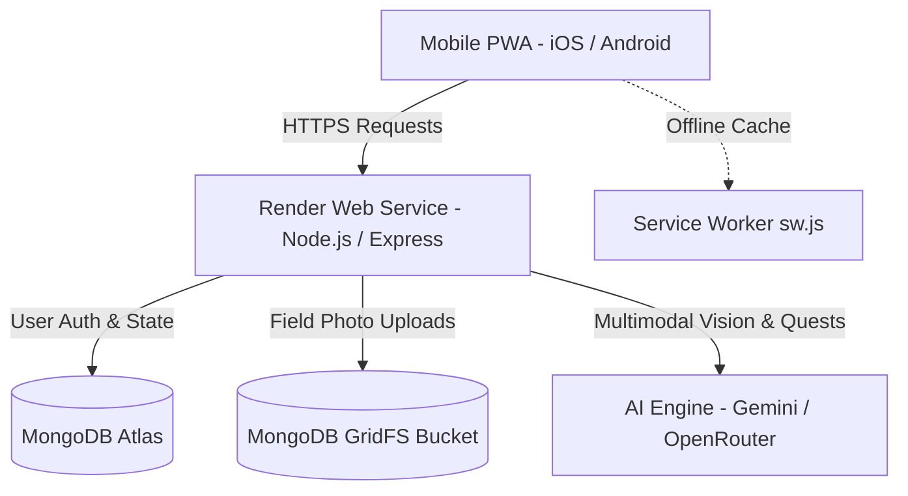

# 🌿 WildDex — The Real-World Field Guide & IRL Pokédex

> **Core Loop:** Go outside → Get a daily quest → Discover nature → Scan & catalog it → Level up in real life.  
> *"The AI isn’t trying to keep you on the screen. It gives you a reason to put the phone down and touch grass."*

---

## 🌐 Live Application & Mobile Installation

WildDex is deployed and running live in production on Render:

👉 **[Launch WildDex in Browser](https://sidequest-0kzp.onrender.com)**

### 📱 Install on Your Phone (Zero App Store Downloads Needed)
WildDex is engineered as an installable Progressive Web App (PWA) with full-screen standalone support:

1. Open **[https://sidequest-0kzp.onrender.com](https://sidequest-0kzp.onrender.com)** on your mobile phone browser:
   - **iPhone (Safari):** Tap the **Share** button ➔ Tap **"Add to Home Screen"**
   - **Android (Chrome):** Tap the **Menu (⋮)** ➔ Tap **"Install App"** or **"Add to Home screen"**
2. An authentic app icon is added to your home screen.
3. Open WildDex directly from your home screen — it runs full-screen like a native mobile app with offline service worker caching (`sw.js`).

---

## 🌟 The 5 Core Features

### 1. 🎮 AI Quest Master (Daily Quests)
- **Tailored Daily Adventures:** Every morning, the AI Quest Master constructs 3 personalized, context-aware outdoor quests based on your location, time budget (15, 30, or 60 min), and nature interests (trees, birds, flowers, insects, rocks, animals).
- **3 Dynamic Quest Types:**
  - `📸 Scan`: *Nature Scout* — Find and photograph a specific specimen you haven't seen today (+50 XP).
  - `👣 Walk`: *Trail Walker* — Walk 1.0 km outside with live HTML5 GPS distance tracking (+30 XP).
  - `👀 Observe`: *Observer* — Notice a subtle environmental detail or seasonal change (+40 XP).
- **Daily Challenge Reward:** Conquering all 3 daily quests awards an extra **+50 XP bonus**.

### 2. 📸 Multimodal AI Vision Scanner (Field Guide AI)
- **Real-Time Camera Viewfinder:** Live HTML5 environment camera stream (`navigator.mediaDevices.getUserMedia`) featuring responsive HUD framing corners, an animated laser scanning beam, and instant file upload support.
- **Strict Anti-Screen & Anti-Cheat Guardrail:**
  - WildDex is built for authentic real-world exploration.
  - The AI vision model actively inspects photos for monitor pixel grids, moiré interference, bezels, screen glare, and digital displays.
  - If a user points their camera at a laptop or monitor, the scan is rejected with a friendly reminder:  
    `Screen detected 💻🚫 — WildDex is an authentic IRL field guide. Please step outside and photograph real physical subjects!`
- **Honest Uncertainty & Confidence Ratings:**
  - **Identified (>80% confidence):** Displays scientific species name, confidence rating (e.g. *92%*), native habitat, and a natural history fun fact.
  - **Possible Match (<80% confidence):** Shows ranked candidate distributions (e.g., *1. Indian Banyan 71%, 2. Peepal Tree 19%*) and suggests taking another photo in clearer daylight.

### 3. 📖 Your Real-World Pokédex (The Discovery Catalog)
- **One Species = One WildDex Entry:** Deduplication ensures clean cataloging. Photographing a species you already registered rewards bonus XP (`Already discovered! 🌳 +5 XP`) without creating redundant clutter.
- **100+ Built-In Field Guide Species:** Pre-indexed catalog spanning 7 categories:
  - 🌿 Plants & Foliage
  - 🌸 Wildflowers & Blossoms
  - 🦅 Birds & Raptors
  - 🦋 Insects & Pollinators
  - 🐾 Mammals & Urban Wildlife
  - 🍄 Mushrooms & Fungi
  - 🪨 Rocks, Minerals & Fossils
- **Specimen Detail Drawer:** Inspect sighting timestamps, captured field photos, GPS coordinates, and historical lore for any collected find.

### 4. ⭐ RPG Leveling & XP Progression
- **Every Outdoor Action Matters:**
  - Complete a quest: **+30 to +80 XP**
  - Discover a new species: **+50 XP**
  - Sighting of an existing species: **+5 XP**
  - Complete daily quest trio: **+50 XP**
  - Walk 1 kilometer: **+20 XP**
- **Explorer Ranks:** Progress from *Junior Scout* through *Trailblazer*, *Field Ranger*, to *Apex Naturalist*.
- **Level-Up Celebrations:** Full-screen modal with particle confetti whenever you reach a new rank.

### 5. 🗺️ Trail Log & Adventure Radar Map
- **Live GPS Breadcrumb Trail:** Plots your walking route and scattered discovery pins on an interactive canvas radar map.
- **Lifetime Outdoor Metrics:** Tracks total kilometers walked, active outdoor minutes, and cumulative discoveries.
- **Daily Streak Tracker:** Keeps explorers motivated with consecutive daily outdoor streaks (e.g., `🔥 3-Day Streak`).

---

## 🏗️ Production Architecture & Tech Stack

### 1. ⚡ Render (Production Cloud Runtime)
- **Declared via Infrastructure-as-Code:** Fully managed web service defined in `render.yaml`.
- **Unified Full-Stack Host:** Serves the mobile PWA frontend, powers the REST API, and hosts the secure AI runtime proxy (`/api/ai`) so API keys remain private.
- **Zero-Downtime Deployments:** Continuous deployment linked to GitHub `main` with built-in health monitoring at `/api/health`.

### 2. 🍃 MongoDB Atlas & GridFS (Data & Media Layer)
- **User Progression & Auth:** Stores explorer accounts with bcrypt-hashed passwords, total XP, and levels.
- **Pokédex & Discoveries:** Persists unique species entries, duplicate sighting counters, and GPS coordinate trails.
- **MongoDB GridFS (`photos` bucket):** Photos are compressed client-side (down to 1200px / ~200KB) and streamed into GridFS binary storage, linked directly to discovery records.

### 3. 🤖 Multimodal AI Pipeline
- **Dual-Provider Resilience:** Server-side proxy in `api/ai.js` connects to multimodal vision and reasoning models with automated failover handling.
- **Zero Client-Side Token Leaks:** The browser communicates strictly with the backend proxy; API credentials are never exposed in client bundles.

---

## 🏆 Hackathon & Prize Tracks

- **Best Use of Render ($200):** Render serves as our complete production runtime—hosting the Node.js service, delivering the mobile PWA, running the AI runtime proxy, and automating deployments.
- **Best Use of MongoDB Atlas ($100):** MongoDB Atlas manages persistent game state, user accounts, and binary photo storage via **MongoDB GridFS**.
- **Best Use of GitHub Copilot ($100):** Developed and iterated using GitHub Copilot CLI and agent workflows to scaffold PWA manifest configs, optimize canvas image compression, and build the GridFS streaming pipeline.

---

## 📄 License

This project is licensed under the [MIT License](LICENSE).
